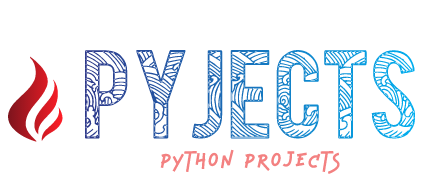

# PyJects

    
     A Collection of all my Python projects.

---

## Table of Contents

- [Motivation](#Motivation)
- [Installation](#Installation)
- [Usage](#Usage)
- [Contributing](#Contributing)
- [License](#License)

## Motivation

I have worked on various Python projects and hence decided to cluster them together into a repository for ease of access and to be able to track my progress.  
Each application has a specific functionality and a motivation behind why I made it. To read more about each of them, just open the folder and go through the **README.md** file

## Installation

Prerequisite : [Python 3](https://www.python.org/downloads/)

For the latest collection of stable programs, head to [releases](https://github.com/SVijayB/PyJects/releases).

Download and extract the source code.

As an alternative, you could also clone the repository using,

<pre>
https://github.com/SVijayB/PyJects.git
</pre>

Some of these applications require you to download other modules or libraries. Make sure you read the usage section of the README.md file present in the folder of the application you are trying to use. 

Some applications use custom fonts. For complete user experience, it is suggested that you install them as well.  
Fonts are added to the application's assets folder.

## Usage

Once you have the source code downloaded and extracted. You can launch the applications by just double tapping on them, if you have the python launcher. Else, open up your terminal and cd to the `src` folder of the application you are trying to launch and type `python filename.py`, where filename is the name of the application.

Make sure you go through the `README.md` file present in the application's folder for complete understanding of the application's functionality and uses.

### Applications currently present in PyJects : 

1. [Chat Room 101](https://github.com/SVijayB/PyJects/tree/master/Chat%20Room%20101) : A Simple GUI based Chat Room Application.

2. [Custom notepad](https://github.com/SVijayB/PyJects/tree/master/Custom%20notepad) : A customized version of window's notepad with additional features.

3. [Spam Botz](https://github.com/SVijayB/PyJects/tree/master/Spam%20Botz) : A simple and easy to use Spam Bot.

4. [Steam WebScraper](https://github.com/SVijayB/PyJects/tree/master/Steam%20WebScraper) : An application built to monitor CS:GO prices on the Steam market.

5. [Typing Speed Test](https://github.com/SVijayB/PyJects/tree/master/Typing%20Speed%20Test) : A GUI based application that calculates typing speed.

6. [YouTube Extractor](https://github.com/SVijayB/PyJects/tree/master/YouTube%20Extractor) : GUI based YouTube Video/Audio Extractor.

7. [Safe Haven](https://github.com/SVijayB/PyJects/tree/master/Safe%20Haven) : An application built to help you hide your secret files and folders

8. [Simple Calculator](https://github.com/SVijayB/PyJects/tree/master/Simple%20Calculator) : A simple calculator built using python's tkinter module.

9. [Password Manager](https://github.com/SVijayB/PyJects/tree/master/Password%20Manager) : An application built to keep your passwords safe and collected.

10. [File Sorter](https://github.com/SVijayB/PyJects/tree/master/File%20Sorter) : Sorts files into dedicated folders based on file type.

## Contributing 

To contribute to PyJects, fork the repository, create a new branch and send us a pull request. Make sure you read [CONTRIBUTING.md](https://github.com/SVijayB/PyJects/blob/master/.github/CONTRIBUTING.md) before sending us Pull requests. 

Also, thanks for contributing to Open-source!

## License 

PyJects is under The MIT License. Read the [LICENSE](https://github.com/SVijayB/PyJects/blob/master/LICENSE) file for more information.