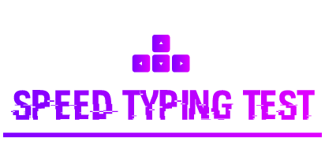

# Typing-Speed-Test

    
     A GUI based application that calculates your typing speed

---

## Motivation

The main objective of this project was to create a simple and easy to use application that would calculate typing speed. This would enable users to increase their typing skills and also monitor their progress.

Most typing tests are online and the ones that are downloadable(offline) are usually just malware. And so, I set out to build my own typing speed test.

## Usage

Typing-Speed-Test uses custom fonts. Most windows computers have them preinstalled. However, if you don't, just open the `Fonts` folder present in assets and launch the `Agency-FB.ttf` and the `Algerian Regular.ttf` files and press install. 

Run `Typing-Speed-Test.py` file present in the `src` folder.

Once you launch the `Typing-Speed-Test.py` file, just select one of the three modes.
- Warmup : A random stream of short and long words that help you warm up your fingers.
- Easy : Short words that help you practice typing.
- Hard : Expertise level, Long and difficult words.

Now, just click on start and follow the instructions shown in the application.